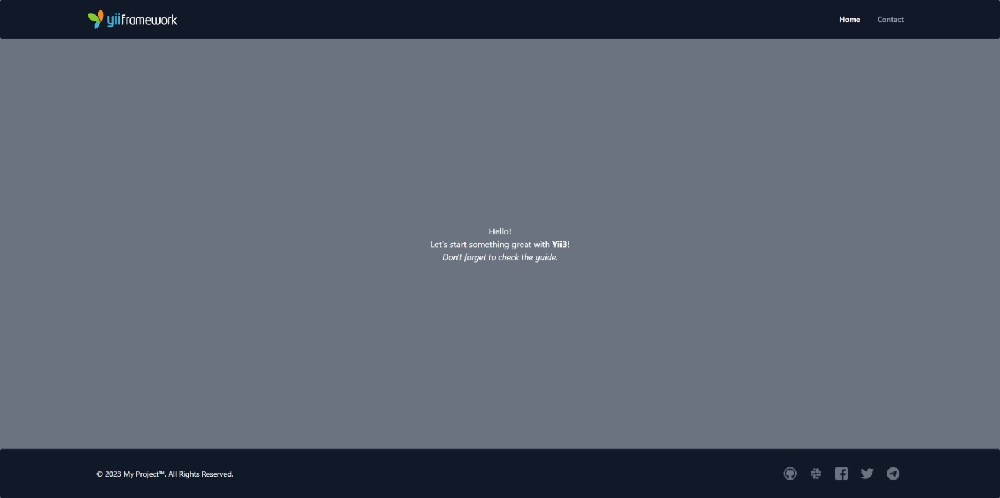

<p align="center">
    <a href="https://github.com/yii-tools/demo" target="_blank">
        
    </a>
    <a href="https://flowbite.com/" target="_blank">
        
    </a>    
    <h1 align="center">Flowbyte Demo for YiiFramework v 3.0.</h1>
    <br>
</p>

<p align="center">
    <a href="https://github.com/yii-tools/demo" target="_blank">
        
    </a>
</p>

## Requirements

The minimum version of PHP required by this package is PHP 8.1.

To install this package, you need a [composer](https://getcomposer.org/).

## Installation

You can then install this project template using the following command:

```shell
git clone https://github.com/yii-tools/demo.git demo
cd demo
composer update --prefer-dist -vvv
```

To launch the application for PHP built-in web server, run the following command:

```shell
composer run serve
```

To launch the application for [RoadRunner](https://roadrunner.dev/) web server, run the following command:

```shell
./vendor/bin/rr get-binary
./rr serve
```

Now you should be able to access the application through the URL printed to console. Usually it is http://localhost:8080.

## Directory structure

The application template has the following structure directory:

```text
root
├── config                          Configuration files.
│   └── common                      Common configuration files.
│   └── web                         Web configuration files.
│   └── application-params.php      Application parameters.
│   └── params.php                  Params configuration.
│   └── routes.php                  Application routes.
├── public                          Files publicly accessible from the Internet.
│   └── assets                      Published assets.
│   └── index.php                   Entry script.
│   └── index-rr.php                Entry script for RoadRunner.
├── resources                       Application resources.
│   └── assets                      Custom assets.
│   └── messages                    Message translations.
│   └── layout                      Layout templates.
│   └── view                        View templates.
├── runtime                         Files generated during runtime.
├── src                             Application source code.
│    └── Asset                      Asset bundle definitions.
│    └── Command                    Console commands.
│    └── Controller                 Web controller classes.
│    └── Handler                    Handlers for events.
|    └── Installer.php              Installer.
├── .env                            Environment variables.
├── .rr-yaml                        RoadRunner configuration.
├── codeception.yml                 Codeception configuration.
├── composer.json                   Composer configuration.
├── di-container.php                Dependency injection container configuration.
├── tailwind.config.js              Tailwind CSS configuration.
```

## Configuration

If you want to customize your **demo**, read the [docs](/docs/config.md).

## CI status

[](https://github.com/yii-tools/demo/actions)
[](https://codecov.io/gh/yii-tools/demo)
[](https://github.com/yii-tools/demo/actions?query=workflow%3A%22static+analysis%22)
[](https://shepherd.dev/github/yii-tools/demo)
[](https://github.styleci.io/repos/613558452?branch=main)

## License

The MIT License (MIT). Please see [License File](LICENSE) for more information.

## Our social networks

[](https://twitter.com/Terabytesoftw)
